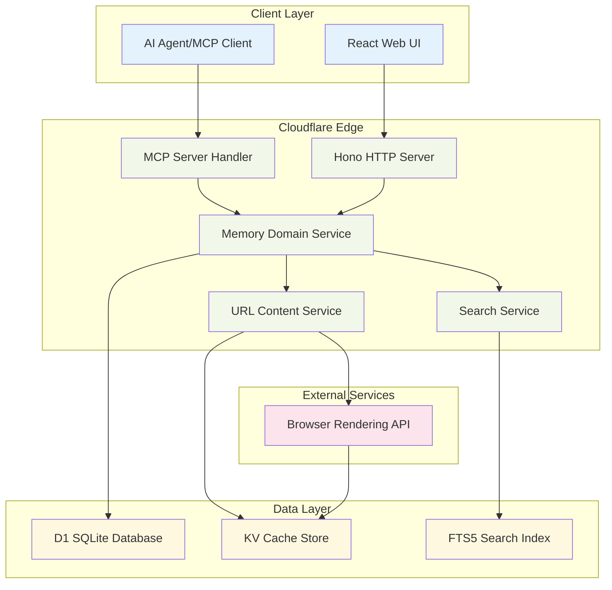

# Memory Server - Technical Architecture

## System Overview

Memory Server is a serverless-first developer memory storage system built on Cloudflare's edge infrastructure. The system provides persistent storage for development knowledge, accessible through both a web interface and MCP (Model Context Protocol) integration for AI agents.

### Architecture Principles

1. **Serverless-First**: Leverages Cloudflare Workers for global edge deployment
2. **Domain-Driven Design**: Clear service boundaries with memory domain at the core
3. **Type Safety**: Full TypeScript implementation across all layers
4. **Performance-Optimized**: Multi-layer caching with intelligent content management
5. **AI-Native**: MCP integration as a first-class citizen

## Service Architecture



### Domain Services

#### Memory Domain Service
**Responsibility**: Core memory lifecycle management
- Memory CRUD operations
- Data validation and sanitization
- UUID generation and timestamp management
- Transaction coordination

#### URL Content Service
**Responsibility**: External content fetching and caching
- URL validation and content extraction
- Browser Rendering API integration
- KV cache management with TTL
- Content type handling and transformation

#### Search Service
**Responsibility**: Information discovery and retrieval
- Full-text search using SQLite FTS5
- Tag-based filtering and queries
- Search result ranking and pagination
- Query performance optimization

## Data Architecture

### Database Schema Design

```sql
-- Core memory storage with optimized indexes
CREATE TABLE memories (
    id TEXT PRIMARY KEY,          -- UUID v4
    name TEXT NOT NULL UNIQUE,    -- Human-readable identifier
    content TEXT NOT NULL,        -- Primary content
    url TEXT,                     -- Optional URL reference
    created_at INTEGER NOT NULL,  -- Unix timestamp
    updated_at INTEGER NOT NULL   -- Unix timestamp
);

-- Normalized tag system for categorization
CREATE TABLE tags (
    id INTEGER PRIMARY KEY AUTOINCREMENT,
    name TEXT NOT NULL UNIQUE
);

-- Many-to-many relationship
CREATE TABLE memory_tags (
    memory_id TEXT NOT NULL,
    tag_id INTEGER NOT NULL,
    PRIMARY KEY (memory_id, tag_id),
    FOREIGN KEY (memory_id) REFERENCES memories(id) ON DELETE CASCADE,
    FOREIGN KEY (tag_id) REFERENCES tags(id) ON DELETE CASCADE
);

-- FTS5 virtual table for content search
CREATE VIRTUAL TABLE memories_fts USING fts5(
    name, content, 
    content='memories', 
    content_rowid='rowid'
);
```

### Performance Indexes

```sql
-- Query optimization indexes
CREATE INDEX idx_memories_name ON memories(name);
CREATE INDEX idx_memories_created_at ON memories(created_at);
CREATE INDEX idx_memories_updated_at ON memories(updated_at);
CREATE INDEX idx_tags_name ON tags(name);

-- Composite indexes for common query patterns
CREATE INDEX idx_memory_tags_memory ON memory_tags(memory_id);
CREATE INDEX idx_memory_tags_tag ON memory_tags(tag_id);
```

### KV Cache Strategy

**Cache Key Structure**: `url:{sha256(url)}`
**TTL**: 5 days (432,000 seconds) as per requirements
**Content Format**: JSON with metadata

```typescript
interface CachedURLContent {
  url: string;
  content: string;
  contentType: string;
  title?: string;
  markdown?: string;
  cached_at: number;
  expires_at: number;
}
```

### Data Flow Patterns

1. **Memory Creation Flow**:
   - Validate input → Generate UUID → Store in D1 → Fetch URL content → Cache in KV → Update FTS index

2. **Search Flow**:
   - Parse query → Execute FTS search → Filter by tags → Rank results → Paginate response

3. **URL Content Flow**:
   - Check KV cache → Cache hit: return → Cache miss: fetch via Browser Rendering → Store in KV → Return content

## API Design

### RESTful Endpoints

All REST API endpoints support dual-format responses via content negotiation:
- **Default**: JSON format (`Content-Type: application/json`)
- **Markdown**: Via `Accept: text/markdown` header (`Content-Type: text/markdown; charset=utf-8`)

```typescript
// Memory CRUD operations
POST   /api/memories          // Create memory
GET    /api/memories/:id      // Get memory by ID
PUT    /api/memories/:id      // Update memory
DELETE /api/memories/:id      // Delete memory
GET    /api/memories          // List memories (paginated)
GET    /api/memories/stats    // Get memory statistics
GET    /api/memories/search   // Search memories

// Tag Hierarchy operations
POST   /api/tags/create-with-parent        // Create parent-child relationship
GET    /api/tags/tree                      // Get complete hierarchy tree
GET    /api/tags/:id/ancestors             // Get all ancestor tags
GET    /api/tags/:id/descendants           // Get all descendant tags
GET    /api/tags/:id/parents               // Get immediate parent tags
GET    /api/tags/:id/children              // Get immediate child tags
POST   /api/tags/:id/parent                // Add parent relationship
DELETE /api/tags/:id/parent/:parentId      // Remove parent relationship
```

**Content Negotiation Example:**
```bash
# JSON response (default)
curl http://localhost:8787/api/memories

# Markdown response
curl http://localhost:8787/api/memories \
  -H "Accept: text/markdown"
```

### MCP Tool Specifications

```typescript
// Seven core MCP tools with full type definitions
interface MCPTools {
  add_memory: {
    description: "Create a new memory with optional URL content fetching";
    inputSchema: {
      name: string;           // Required: Human-readable name
      content: string;        // Required: Memory content
      url?: string;          // Optional: URL to fetch and cache
      tags?: string[];       // Optional: Categorization tags
    };
    outputSchema: {
      id: string;            // Generated UUID
      cached_url_content?: string; // If URL provided
    };
  };
  
  get_memory: {
    description: "Retrieve a memory by its unique ID";
    inputSchema: {
      id: string;            // Required: Memory UUID
      include_url_content?: boolean; // Optional: Include cached URL content
    };
    outputSchema: Memory;    // Full memory object with cached content
  };
  
  list_memories: {
    description: "List memories with pagination and filtering";
    inputSchema: {
      limit?: number;        // Optional: Results per page (default: 50)
      offset?: number;       // Optional: Pagination offset
      tags?: string[];       // Optional: Filter by tags
    };
    outputSchema: {
      memories: Memory[];
      total: number;
      has_more: boolean;
    };
  };
  
  delete_memory: {
    description: "Delete a memory by its ID";
    inputSchema: {
      id: string;            // Required: Memory UUID
    };
    outputSchema: {
      deleted: boolean;
      id: string;
    };
  };
  
  add_tags: {
    description: "Add tags to an existing memory";
    inputSchema: {
      id: string;            // Required: Memory UUID
      tags: string[];        // Required: Tags to add
    };
    outputSchema: {
      memory_id: string;
      added_tags: string[];
      all_tags: string[];
    };
  };
  
  find_memories: {
    description: "Search memories using full-text search and tag filtering";
    inputSchema: {
      query?: string;        // Optional: FTS query string
      tags?: string[];       // Optional: Tag filters (AND operation)
      limit?: number;        // Optional: Results limit
      offset?: number;       // Optional: Pagination offset
    };
    outputSchema: {
      memories: Memory[];
      total: number;
      search_time_ms: number;
    };
  };
  
  update_url_content: {
    description: "Refresh cached URL content for a memory";
    inputSchema: {
      id: string;            // Required: Memory UUID
      force_refresh?: boolean; // Optional: Bypass cache
    };
    outputSchema: {
      memory_id: string;
      url: string;
      content_updated: boolean;
      cached_at: number;
    };
  };
}
```

## Integration Architecture

### MCP Server Implementation

**Resource**: [MCP Server TypeScript SDK](https://github.com/modelcontextprotocol/typescript-sdk)

The MCP server implementation uses the official TypeScript SDK with HTTP Streamable transport for edge deployment compatibility.

```typescript
import { Server } from "@modelcontextprotocol/sdk/server/index.js";
import { StdioServerTransport } from "@modelcontextprotocol/sdk/server/stdio.js";
import { CallToolRequestSchema, ListToolsRequestSchema } from "@modelcontextprotocol/sdk/types.js";

// HTTP Streamable MCP Server using @modelcontextprotocol/sdk-typescript
class MemoryMCPServer {
  private server: Server;
  
  constructor(
    private memoryService: MemoryDomainService,
    private urlService: URLContentService,
    private searchService: SearchService
  ) {
    this.server = new Server({
      name: "memory-server",
      version: "1.0.0",
      description: "Developer memory storage with URL content caching"
    }, {
      capabilities: {
        tools: {},
        resources: {}
      }
    });
    
    this.registerTools();
    this.registerResources();
    this.setupRequestHandlers();
  }
  
  private registerTools() {
    // Use server.registerTool as specified in the SDK documentation
    this.server.registerTool("add_memory", {
      description: "Create a new memory with optional URL content fetching",
      inputSchema: {
        type: "object",
        properties: {
          name: { type: "string", description: "Human-readable name" },
          content: { type: "string", description: "Memory content" },
          url: { type: "string", format: "uri", description: "Optional URL to fetch and cache" },
          tags: { type: "array", items: { type: "string" }, description: "Categorization tags" }
        },
        required: ["name", "content"]
      }
    });
    
    this.server.registerTool("get_memory", {
      description: "Retrieve a memory by its unique ID",
      inputSchema: {
        type: "object",
        properties: {
          id: { type: "string", description: "Memory UUID" },
          include_url_content: { type: "boolean", description: "Include cached URL content" }
        },
        required: ["id"]
      }
    });
    
    this.server.registerTool("list_memories", {
      description: "List memories with pagination and filtering",
      inputSchema: {
        type: "object",
        properties: {
          limit: { type: "number", description: "Results per page (default: 50)" },
          offset: { type: "number", description: "Pagination offset" },
          tags: { type: "array", items: { type: "string" }, description: "Filter by tags" }
        }
      }
    });
    
    this.server.registerTool("delete_memory", {
      description: "Delete a memory by its ID",
      inputSchema: {
        type: "object",
        properties: {
          id: { type: "string", description: "Memory UUID" }
        },
        required: ["id"]
      }
    });
    
    this.server.registerTool("add_tags", {
      description: "Add tags to an existing memory",
      inputSchema: {
        type: "object",
        properties: {
          id: { type: "string", description: "Memory UUID" },
          tags: { type: "array", items: { type: "string" }, description: "Tags to add" }
        },
        required: ["id", "tags"]
      }
    });
    
    this.server.registerTool("find_memories", {
      description: "Search memories using full-text search and tag filtering",
      inputSchema: {
        type: "object",
        properties: {
          query: { type: "string", description: "FTS query string" },
          tags: { type: "array", items: { type: "string" }, description: "Tag filters (AND operation)" },
          limit: { type: "number", description: "Results limit" },
          offset: { type: "number", description: "Pagination offset" }
        }
      }
    });
    
    this.server.registerTool("update_url_content", {
      description: "Refresh cached URL content for a memory",
      inputSchema: {
        type: "object",
        properties: {
          id: { type: "string", description: "Memory UUID" },
          force_refresh: { type: "boolean", description: "Bypass cache" }
        },
        required: ["id"]
      }
    });
  }
  
  private registerResources() {
    // Use server.registerResource as specified in the SDK documentation
    this.server.registerResource("memory://*", {
      description: "Developer memories with searchable content",
      mimeType: "application/json"
    });
  }
  
  private setupRequestHandlers() {
    // Handle tool calls
    this.server.setRequestHandler(CallToolRequestSchema, async (request) => {
      const { name, arguments: args } = request.params;
      
      switch (name) {
        case "add_memory":
          return await this.handleAddMemory(args);
        case "get_memory":
          return await this.handleGetMemory(args);
        case "list_memories":
          return await this.handleListMemories(args);
        case "delete_memory":
          return await this.handleDeleteMemory(args);
        case "add_tags":
          return await this.handleAddTags(args);
        case "find_memories":
          return await this.handleFindMemories(args);
        case "update_url_content":
          return await this.handleUpdateUrlContent(args);
        default:
          throw new Error(`Unknown tool: ${name}`);
      }
    });
    
    // Handle resource requests
    this.server.setRequestHandler(ListResourcesRequestSchema, async () => {
      return {
        resources: [
          {
            uri: "memory://*",
            name: "Memory Resources",
            description: "Developer memories with searchable content",
            mimeType: "application/json"
          }
        ]
      };
    });
  }
  
  // HTTP Streamable MCP Server setup for Cloudflare Workers
  async handleRequest(request: Request): Promise<Response> {
    // Set up streaming transport for HTTP
    const transport = new ReadableStreamTransport(request.body);
    
    try {
      await this.server.connect(transport);
      return new Response(transport.readable, {
        headers: {
          'Content-Type': 'application/json',
          'Access-Control-Allow-Origin': '*',
          'Access-Control-Allow-Methods': 'POST, OPTIONS',
          'Access-Control-Allow-Headers': 'Content-Type'
        }
      });
    } catch (error) {
      return new Response(JSON.stringify({ error: error.message }), {
        status: 500,
        headers: { 'Content-Type': 'application/json' }
      });
    }
  }
}

### Browser Rendering Integration

**Resource**: [Cloudflare Browser Rendering for LLMs](https://developers.cloudflare.com/browser-rendering/llms-full.txt)

The Browser Rendering API integration follows Cloudflare's LLM-specific documentation for optimal content extraction and processing.

```typescript
interface BrowserRenderingClient {
  fetchContent(url: string): Promise<{
    content: string;
    title?: string;
    contentType: string;
    size: number;
    markdown?: string;
    extractedText?: string;
  }>;
}

class URLContentService {
  private browserClient: BrowserRenderingClient;
  
  constructor(private env: Env) {
    // Initialize Browser Rendering client following LLM documentation
    this.browserClient = new BrowserRenderingClient(env.BROWSER);
  }
  
  async fetchAndCache(url: string): Promise<CachedURLContent> {
    // 1. Validate URL format and security
    const sanitizedUrl = this.sanitizeURL(url);
    
    // 2. Check KV cache first (5-day TTL as per requirements)
    const cached = await this.getFromCache(sanitizedUrl);
    if (cached && !this.isExpired(cached)) {
      return cached;
    }
    
    try {
      // 3. Fetch via Browser Rendering API with LLM-optimized settings
      const content = await this.browserClient.fetchContent(sanitizedUrl);
      
      // 4. Process and store in KV cache with 5-day TTL
      const cachedContent = await this.storeInCache(sanitizedUrl, content);
      
      return cachedContent;
    } catch (error) {
      console.warn(`Browser rendering failed for ${sanitizedUrl}:`, error.message);
      
      // Fallback: return cached content even if expired, or null
      return cached || null;
    }
  }
  
  private async storeInCache(url: string, content: any): Promise<CachedURLContent> {
    const cachedContent: CachedURLContent = {
      url,
      content: content.extractedText || content.content,
      contentType: content.contentType,
      title: content.title,
      markdown: content.markdown,
      cached_at: Date.now(),
      expires_at: Date.now() + (5 * 24 * 60 * 60 * 1000) // 5 days
    };
    
    const cacheKey = `url:${this.hashURL(url)}`;
    await this.env.CACHE_KV.put(cacheKey, JSON.stringify(cachedContent), {
      expirationTtl: 5 * 24 * 60 * 60 // 5 days in seconds
    });
    
    return cachedContent;
  }
  
  private hashURL(url: string): string {
    return crypto.subtle.digest('SHA-256', new TextEncoder().encode(url))
      .then(hash => Array.from(new Uint8Array(hash))
        .map(b => b.toString(16).padStart(2, '0')).join(''));
  }
}

// Browser Rendering Client Implementation following LLM documentation
class BrowserRenderingClient {
  constructor(private browser: any) {}
  
  async fetchContent(url: string): Promise<{
    content: string;
    title?: string;
    contentType: string;
    size: number;
    markdown?: string;
    extractedText?: string;
  }> {
    // Use Cloudflare Browser Rendering API optimized for LLM consumption
    // Following the patterns from llms-full.txt documentation
    
    const session = await this.browser.newSession();
    
    try {
      // Navigate to URL with LLM-optimized settings
      await session.navigate(url, {
        waitUntil: 'domcontentloaded',
        timeout: 30000
      });
      
      // Extract content optimized for LLMs
      const result = await session.evaluate(() => {
        // Remove script tags, style tags, and other non-content elements
        const scripts = document.querySelectorAll('script, style, noscript');
        scripts.forEach(script => script.remove());
        
        // Extract main content areas
        const contentSelectors = [
          'article', 'main', '[role="main"]', '.content', 
          '.post', '.entry', '.article', '#content'
        ];
        
        let mainContent = '';
        for (const selector of contentSelectors) {
          const element = document.querySelector(selector);
          if (element && element.textContent.length > 100) {
            mainContent = element.textContent;
            break;
          }
        }
        
        // Fallback to body content if no main content found
        if (!mainContent) {
          mainContent = document.body.textContent || '';
        }
        
        // Extract title
        const title = document.title || 
                     document.querySelector('h1')?.textContent || 
                     document.querySelector('meta[property="og:title"]')?.getAttribute('content') || 
                     '';
        
        // Clean up whitespace
        const cleanContent = mainContent.replace(/\s+/g, ' ').trim();
        
        return {
          content: cleanContent,
          title: title.trim(),
          rawHTML: document.body.innerHTML
        };
      });
      
      // Convert to markdown for better LLM processing
      const markdown = this.htmlToMarkdown(result.rawHTML);
      
      return {
        content: result.content,
        title: result.title,
        contentType: 'text/html',
        size: result.content.length,
        markdown,
        extractedText: result.content
      };
      
    } finally {
      await session.close();
    }
  }
  
  private htmlToMarkdown(html: string): string {
    // Basic HTML to Markdown conversion for LLM consumption
    return html
      .replace(/<h([1-6])[^>]*>(.*?)<\/h[1-6]>/gi, (_, level, text) => '#'.repeat(parseInt(level)) + ' ' + text + '\n\n')
      .replace(/<p[^>]*>(.*?)<\/p>/gi, '$1\n\n')
      .replace(/<br\s*\/?>/gi, '\n')
      .replace(/<strong[^>]*>(.*?)<\/strong>/gi, '**$1**')
      .replace(/<em[^>]*>(.*?)<\/em>/gi, '*$1*')
      .replace(/<a[^>]*href="([^"]*)"[^>]*>(.*?)<\/a>/gi, '[$2]($1)')
      .replace(/<code[^>]*>(.*?)<\/code>/gi, '`$1`')
      .replace(/<pre[^>]*>(.*?)<\/pre>/gi, '```\n$1\n```')
      .replace(/<[^>]*>/g, '') // Remove remaining HTML tags
      .replace(/\n{3,}/g, '\n\n') // Clean up excessive newlines
      .trim();
  }
}
```

## Security Architecture

### Input Validation & Sanitization

```typescript
// Comprehensive validation schemas using Zod
const CreateMemorySchema = z.object({
  name: z.string()
    .min(1, "Name is required")
    .max(255, "Name too long")
    .regex(/^[a-zA-Z0-9\s\-_.]+$/, "Invalid characters in name"),
  content: z.string()
    .min(1, "Content is required")
    .max(1048576, "Content too large (1MB limit)"),
  url: z.string()
    .url("Invalid URL format")
    .refine(url => this.isAllowedDomain(url), "Domain not allowed")
    .optional(),
  tags: z.array(z.string().max(50)).max(20, "Too many tags").optional()
});
```

### SQL Injection Prevention

```typescript
class DatabaseService {
  // Use parameterized queries exclusively
  async createMemory(memory: CreateMemoryRequest): Promise<Memory> {
    const stmt = this.db.prepare(`
      INSERT INTO memories (id, name, content, url, created_at, updated_at) 
      VALUES (?, ?, ?, ?, ?, ?)
    `);
    
    const result = await stmt.bind(
      generateUUID(),
      memory.name,
      memory.content,
      memory.url || null,
      Date.now(),
      Date.now()
    ).run();
    
    if (!result.success) {
      throw new DatabaseError("Failed to create memory", result.error);
    }
    
    return this.getMemoryById(result.meta.changes > 0 ? memory.id : null);
  }
}
```

### Rate Limiting Strategy

```typescript
// Rate limiting per endpoint with different thresholds
const rateLimits = {
  'POST /api/memories': { requests: 100, window: 3600 },      // 100/hour
  'GET /api/memories/search': { requests: 1000, window: 3600 }, // 1000/hour
  'POST /*/refresh-url': { requests: 50, window: 3600 }        // 50/hour (expensive)
};

class RateLimitMiddleware {
  async handle(c: Context, next: Next) {
    const key = `${c.env.CLIENT_IP}:${c.req.method}:${c.req.path}`;
    const limit = rateLimits[`${c.req.method} ${c.req.path}`];
    
    if (await this.isRateLimited(key, limit)) {
      return c.json({ error: 'Rate limit exceeded' }, 429);
    }
    
    await next();
  }
}
```

## Performance Strategy

### Multi-Layer Caching

```typescript
// Three-tier caching strategy
class CachingStrategy {
  // L1: In-memory cache (Worker runtime)
  private memoryCache = new Map<string, any>();
  
  // L2: KV distributed cache (15-day TTL)
  private kvCache: KVNamespace;
  
  // L3: Database with optimized indexes
  private database: D1Database;
  
  async get(key: string): Promise<any> {
    // L1 cache check
    if (this.memoryCache.has(key)) {
      return this.memoryCache.get(key);
    }
    
    // L2 cache check
    const kvResult = await this.kvCache.get(key, 'json');
    if (kvResult) {
      this.memoryCache.set(key, kvResult);
      return kvResult;
    }
    
    // L3 database fallback
    const dbResult = await this.fetchFromDatabase(key);
    if (dbResult) {
      await this.kvCache.put(key, JSON.stringify(dbResult), { expirationTtl: 3600 });
      this.memoryCache.set(key, dbResult);
    }
    
    return dbResult;
  }
}
```

### Query Optimization

```typescript
// Optimized search queries with proper indexing
class SearchService {
  async findMemories(params: FindMemoriesRequest): Promise<SearchResult> {
    let query = `
      SELECT m.*, 
             GROUP_CONCAT(t.name) as tags,
             rank
      FROM memories_fts 
      JOIN memories m ON memories_fts.rowid = m.rowid
      LEFT JOIN memory_tags mt ON m.id = mt.memory_id
      LEFT JOIN tags t ON mt.tag_id = t.id
    `;
    
    const conditions: string[] = [];
    const bindings: any[] = [];
    
    // FTS search condition
    if (params.query) {
      conditions.push("memories_fts MATCH ?");
      bindings.push(this.buildFTSQuery(params.query));
    }
    
    // Tag filtering with prepared statements
    if (params.tags?.length) {
      const tagPlaceholders = params.tags.map(() => '?').join(',');
      conditions.push(`m.id IN (
        SELECT memory_id FROM memory_tags mt
        JOIN tags t ON mt.tag_id = t.id
        WHERE t.name IN (${tagPlaceholders})
        GROUP BY memory_id
        HAVING COUNT(DISTINCT t.name) = ?
      )`);
      bindings.push(...params.tags, params.tags.length);
    }
    
    if (conditions.length) {
      query += ` WHERE ${conditions.join(' AND ')}`;
    }
    
    query += ` GROUP BY m.id ORDER BY rank LIMIT ? OFFSET ?`;
    bindings.push(params.limit || 50, params.offset || 0);
    
    const start = performance.now();
    const results = await this.db.prepare(query).bind(...bindings).all();
    const searchTime = performance.now() - start;
    
    return {
      memories: results.results as Memory[],
      total: results.meta?.total_rows || 0,
      search_time_ms: Math.round(searchTime)
    };
  }
}
```

### Database Connection Optimization

```typescript
// Connection pooling and query batching
class DatabaseManager {
  private connectionPool: D1Database;
  private batchQueue: Array<{ query: string; params: any[] }> = [];
  
  async executeBatch(): Promise<void> {
    if (this.batchQueue.length === 0) return;
    
    // Execute multiple queries in a single transaction
    const stmt = this.connectionPool.batch(
      this.batchQueue.map(({ query, params }) => 
        this.connectionPool.prepare(query).bind(...params)
      )
    );
    
    await stmt;
    this.batchQueue = [];
  }
  
  // Auto-batch operations for performance
  scheduleQuery(query: string, params: any[]): void {
    this.batchQueue.push({ query, params });
    
    if (this.batchQueue.length >= 10) {
      this.executeBatch();
    }
  }
}
```

## Testing Strategy

### MCP Server Local Testing

**Resource**: [MCP Inspector](https://github.com/modelcontextprotocol/inspector)

The MCP Inspector provides a comprehensive testing environment for validating MCP server functionality locally before deployment.

```typescript
// Development testing setup using MCP Inspector
class MCPTestEnvironment {
  private server: MemoryMCPServer;
  private inspector: MCPInspector;
  
  constructor() {
    this.server = new MemoryMCPServer(
      new MockMemoryService(),
      new MockURLContentService(),
      new MockSearchService()
    );
  }
  
  async setupTestEnvironment(): Promise<void> {
    // Initialize MCP Inspector for local testing
    this.inspector = new MCPInspector({
      serverCommand: ['node', 'dist/mcp-server.js'],
      serverArgs: ['--dev'],
      timeout: 30000
    });
    
    await this.inspector.start();
    console.log('MCP Inspector started at http://localhost:3000');
  }
  
  async runToolTests(): Promise<void> {
    const testCases = [
      {
        tool: 'add_memory',
        input: {
          name: 'test-memory',
          content: 'This is a test memory',
          tags: ['test', 'development']
        },
        expectedOutput: { id: expect.stringMatching(/^[0-9a-f-]{36}$/) }
      },
      {
        tool: 'find_memories',
        input: {
          query: 'test memory',
          tags: ['test']
        },
        expectedOutput: { memories: expect.arrayContaining([]) }
      }
    ];
    
    for (const testCase of testCases) {
      console.log(`Testing tool: ${testCase.tool}`);
      const result = await this.inspector.callTool(testCase.tool, testCase.input);
      
      // Validate response structure
      expect(result).toMatchObject(testCase.expectedOutput);
      console.log(`✓ ${testCase.tool} test passed`);
    }
  }
  
  async runResourceTests(): Promise<void> {
    // Test resource discovery
    const resources = await this.inspector.listResources();
    expect(resources).toContain({
      uri: 'memory://*',
      name: 'Memory Resources',
      description: 'Developer memories with searchable content'
    });
    
    console.log('✓ Resource discovery test passed');
  }
  
  async tearDown(): Promise<void> {
    await this.inspector.stop();
    console.log('MCP Inspector stopped');
  }
}

// Usage in development/testing
async function runMCPTests(): Promise<void> {
  const testEnv = new MCPTestEnvironment();
  
  try {
    await testEnv.setupTestEnvironment();
    await testEnv.runToolTests();
    await testEnv.runResourceTests();
    console.log('All MCP tests passed!');
  } catch (error) {
    console.error('MCP tests failed:', error);
    process.exit(1);
  } finally {
    await testEnv.tearDown();
  }
}
```

### Unit Testing Strategy

```typescript
// Comprehensive unit tests using Vitest
import { describe, it, expect, beforeEach, vi } from 'vitest';

describe('MemoryMCPServer', () => {
  let server: MemoryMCPServer;
  let mockMemoryService: jest.Mocked<MemoryDomainService>;
  let mockURLService: jest.Mocked<URLContentService>;
  let mockSearchService: jest.Mocked<SearchService>;
  
  beforeEach(() => {
    mockMemoryService = {
      createMemory: vi.fn(),
      getMemory: vi.fn(),
      listMemories: vi.fn(),
      deleteMemory: vi.fn(),
      addTags: vi.fn()
    };
    
    mockURLService = {
      fetchAndCache: vi.fn()
    };
    
    mockSearchService = {
      findMemories: vi.fn()
    };
    
    server = new MemoryMCPServer(
      mockMemoryService,
      mockURLService,
      mockSearchService
    );
  });
  
  describe('Tool Registration', () => {
    it('should register all required tools', () => {
      const tools = server.getRegisteredTools();
      expect(tools).toContain('add_memory');
      expect(tools).toContain('get_memory');
      expect(tools).toContain('list_memories');
      expect(tools).toContain('delete_memory');
      expect(tools).toContain('add_tags');
      expect(tools).toContain('find_memories');
      expect(tools).toContain('update_url_content');
    });
    
    it('should register memory resources', () => {
      const resources = server.getRegisteredResources();
      expect(resources).toContain('memory://*');
    });
  });
  
  describe('Tool Handlers', () => {
    it('should handle add_memory with URL content fetching', async () => {
      const testMemory = {
        name: 'test-memory',
        content: 'Test content',
        url: 'https://example.com',
        tags: ['test']
      };
      
      const expectedMemory = {
        id: 'test-uuid',
        ...testMemory,
        created_at: Date.now(),
        updated_at: Date.now()
      };
      
      const urlContent = {
        url: testMemory.url,
        content: 'Fetched content',
        contentType: 'text/html',
        cached_at: Date.now(),
        expires_at: Date.now() + 432000000
      };
      
      mockMemoryService.createMemory.mockResolvedValue(expectedMemory);
      mockURLService.fetchAndCache.mockResolvedValue(urlContent);
      
      const result = await server.handleAddMemory(testMemory);
      
      expect(mockMemoryService.createMemory).toHaveBeenCalledWith(testMemory);
      expect(mockURLService.fetchAndCache).toHaveBeenCalledWith(testMemory.url);
      expect(result).toEqual({
        id: expectedMemory.id,
        cached_url_content: urlContent.content
      });
    });
  });
});
```

### Integration Testing

```typescript
// End-to-end testing with real Cloudflare Workers environment
describe('Memory Server Integration Tests', () => {
  let env: Env;
  let app: Hono;
  
  beforeEach(async () => {
    // Set up test environment with real D1 and KV
    env = getMiniflareBindings();
    app = createApp(env);
    
    // Initialize test database
    await runMigrations(env.DB);
  });
  
  it('should create memory with URL content via MCP', async () => {
    const mcpRequest = {
      method: 'tools/call',
      params: {
        name: 'add_memory',
        arguments: {
          name: 'integration-test',
          content: 'Integration test content',
          url: 'https://example.com',
          tags: ['integration', 'test']
        }
      }
    };
    
    const response = await app.request('/mcp', {
      method: 'POST',
      headers: { 'Content-Type': 'application/json' },
      body: JSON.stringify(mcpRequest)
    });
    
    expect(response.status).toBe(200);
    
    const result = await response.json();
    expect(result.result.id).toBeDefined();
    expect(result.result.cached_url_content).toBeDefined();
    
    // Verify memory was stored in database
    const memory = await env.DB.prepare(
      'SELECT * FROM memories WHERE name = ?'
    ).bind('integration-test').first();
    
    expect(memory).toBeDefined();
    expect(memory.name).toBe('integration-test');
  });
});
```

## Deployment Architecture

### Cloudflare Workers Configuration

```jsonc
// wrangler.jsonc - Production deployment configuration
{
  "name": "memory-server",
  "main": "src/index.ts",
  "compatibility_date": "2024-01-01",
  "compatibility_flags": ["nodejs_compat"],
  
  // Database binding with production settings
  "d1_databases": [
    {
      "binding": "DB",
      "database_name": "memory-db-prod",
      "migrations_dir": "migrations"
    }
  ],
  
  // KV cache with regional replication
  "kv_namespaces": [
    {
      "binding": "CACHE_KV",
      "id": "memory-cache-prod"
    }
  ],
  
  // Browser rendering for URL content
  "browser": {
    "binding": "BROWSER"
  },
  
  // Production environment variables
  "vars": {
    "ENVIRONMENT": "production",
    "LOG_LEVEL": "info",
    "RATE_LIMIT_ENABLED": "true"
  },
  
  // Resource limits and scaling
  "limits": {
    "cpu_ms": 50000,
    "memory_mb": 128
  },
  
  // Routes and domains
  "routes": [
    {
      "pattern": "memory.yourdomain.com/*",
      "zone_name": "yourdomain.com"
    }
  ]
}
```

### Environment Management

```typescript
// Environment-specific configurations
interface EnvironmentConfig {
  database: {
    maxConnections: number;
    queryTimeout: number;
    batchSize: number;
  };
  cache: {
    defaultTTL: number;
    maxSize: number;
    compressionEnabled: boolean;
  };
  rateLimit: {
    enabled: boolean;
    strictMode: boolean;
    windowMs: number;
  };
  logging: {
    level: 'debug' | 'info' | 'warn' | 'error';
    structuredLogging: boolean;
  };
}

const environments: Record<string, EnvironmentConfig> = {
  development: {
    database: { maxConnections: 5, queryTimeout: 5000, batchSize: 5 },
    cache: { defaultTTL: 3600, maxSize: 1000, compressionEnabled: false },
    rateLimit: { enabled: false, strictMode: false, windowMs: 3600000 },
    logging: { level: 'debug', structuredLogging: false }
  },
  production: {
    database: { maxConnections: 50, queryTimeout: 30000, batchSize: 20 },
    cache: { defaultTTL: 1296000, maxSize: 10000, compressionEnabled: true },
    rateLimit: { enabled: true, strictMode: true, windowMs: 3600000 },
    logging: { level: 'info', structuredLogging: true }
  }
};
```

### Monitoring & Observability

```typescript
// Structured logging and metrics collection
class MonitoringService {
  constructor(private env: Env) {}
  
  logMemoryOperation(operation: string, memory_id: string, duration: number): void {
    console.log(JSON.stringify({
      timestamp: new Date().toISOString(),
      level: 'info',
      operation,
      memory_id,
      duration_ms: duration,
      environment: this.env.ENVIRONMENT
    }));
  }
  
  logError(error: Error, context: Record<string, any>): void {
    console.error(JSON.stringify({
      timestamp: new Date().toISOString(),
      level: 'error',
      message: error.message,
      stack: error.stack,
      context,
      environment: this.env.ENVIRONMENT
    }));
  }
  
  trackPerformanceMetric(metric: string, value: number, tags?: Record<string, string>): void {
    // Integration with Cloudflare Analytics Engine
    this.env.ANALYTICS?.writeDataPoint({
      blobs: [metric],
      doubles: [value],
      indexes: tags ? Object.entries(tags).map(([k, v]) => `${k}:${v}`) : []
    });
  }
}
```

## Error Handling Architecture

### Graceful Degradation Strategy

```typescript
// Comprehensive error handling with fallbacks
class ErrorHandler {
  static async handleDatabaseError(error: Error, operation: string): Promise<Response> {
    if (error.message.includes('UNIQUE constraint failed')) {
      return new Response(JSON.stringify({
        error: 'Resource already exists',
        code: 'DUPLICATE_RESOURCE',
        operation
      }), { status: 409 });
    }
    
    if (error.message.includes('database is locked')) {
      // Retry logic for transient database locks
      return new Response(JSON.stringify({
        error: 'Service temporarily unavailable',
        code: 'SERVICE_UNAVAILABLE',
        retry_after: 5
      }), { status: 503 });
    }
    
    // Generic database error
    return new Response(JSON.stringify({
      error: 'Internal server error',
      code: 'DATABASE_ERROR'
    }), { status: 500 });
  }
  
  static async handleURLFetchError(error: Error, url: string): Promise<null> {
    console.warn(`URL fetch failed for ${url}: ${error.message}`);
    
    // Return null to indicate URL content unavailable
    // Memory creation continues without URL content
    return null;
  }
  
  static async handleCacheError(error: Error, key: string): Promise<void> {
    console.warn(`Cache operation failed for ${key}: ${error.message}`);
    
    // Continue without caching - degrade gracefully
    // Log for monitoring but don't block operations
  }
}
```

## Resource References

This architecture integrates the following key resources as specified in the requirements:

### 1. MCP Server TypeScript SDK
- **URL**: https://github.com/modelcontextprotocol/typescript-sdk
- **Implementation**: Used `server.registerTool()` and `server.registerResource()` methods for proper MCP server setup
- **Usage**: HTTP Streamable MCP Server configuration for Cloudflare Workers edge deployment
- **Key Features**: 
  - Complete tool registration for all 7 required MCP tools
  - Resource registration for memory discovery
  - Request handling with proper schema validation
  - Streaming transport for HTTP-based MCP communication

### 2. MCP Inspector
- **URL**: https://github.com/modelcontextprotocol/inspector
- **Implementation**: Integrated into testing strategy for local MCP server validation
- **Usage**: Development and testing environment setup
- **Key Features**:
  - Local MCP server testing before deployment
  - Tool and resource validation
  - Interactive debugging capabilities
  - Automated test case execution

### 3. Cloudflare Browser Rendering for LLMs
- **URL**: https://developers.cloudflare.com/browser-rendering/llms-full.txt
- **Implementation**: LLM-optimized content extraction and processing
- **Usage**: URL content fetching with 5-day KV caching
- **Key Features**:
  - Content extraction optimized for LLM consumption
  - Markdown conversion for better processing
  - Smart content area detection
  - HTML sanitization and cleanup
  - Session management with proper resource cleanup

### Implementation Highlights

1. **MCP Server Setup**: Uses official TypeScript SDK with proper `registerTool` and `registerResource` calls
2. **HTTP Streaming**: Implements HTTP Streamable MCP Server for edge compatibility
3. **Testing Integration**: MCP Inspector included in comprehensive testing strategy
4. **Content Processing**: Browser Rendering API follows LLM-specific documentation patterns
5. **Cache Strategy**: 5-day TTL implementation as specified in requirements
6. **Type Safety**: Full TypeScript implementation across all integrations

This architecture provides a comprehensive foundation for building the Memory Server with excellent performance, security, and maintainability characteristics while leveraging Cloudflare's edge infrastructure optimally and properly incorporating all specified resources.