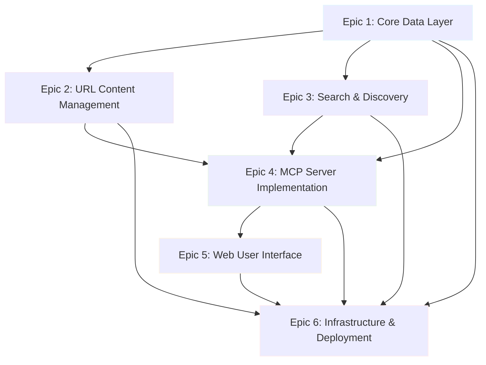
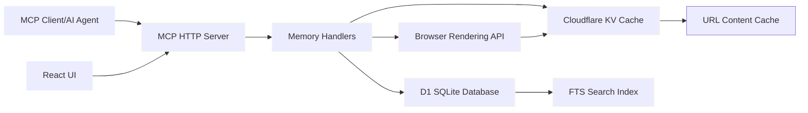
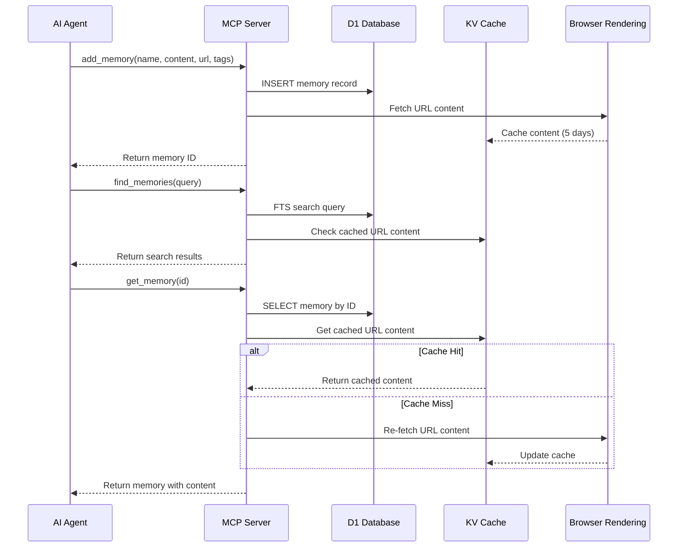
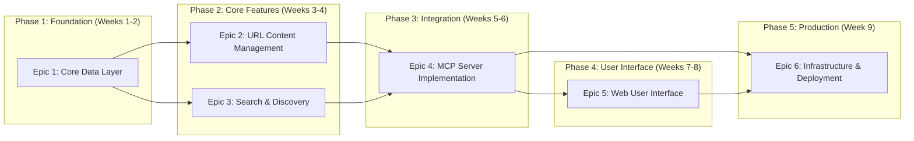

# Memory Server - Epic Breakdown and Implementation Issues

## Epic Overview and Dependencies



## Data Flow Architecture



## User Journey Workflow



---

## Epic 1: Core Data Layer
**Priority:** P0 (Must Have)  
**Dependencies:** None (Foundation)  
**Estimated Effort:** 8 Story Points  

### Epic Description
As a system architect, I want a robust data persistence layer so that memories can be stored, retrieved, and managed efficiently with proper data integrity and performance.

### Issues

#### Issue 1.1: Database Schema Design
**Story Points:** 2  
**Priority:** P0  
```sql
-- Acceptance Criteria:
-- ✅ Memory table with all required fields
-- ✅ Proper indexes for performance
-- ✅ UUID primary keys
-- ✅ Timestamp triggers for created_at/updated_at
```

**Tasks:**
- [ ] Design SQLite schema for memories table
- [ ] Create indexes for name, tags, and FTS
- [ ] Implement UUID generation
- [ ] Set up timestamp triggers
- [ ] Write migration scripts

#### Issue 1.2: Memory Data Model
**Story Points:** 2  
**Priority:** P0  
**Dependencies:** 1.1  

**Tasks:**
- [ ] Define TypeScript interfaces for Memory
- [ ] Implement data validation schemas
- [ ] Create serialization/deserialization methods
- [ ] Add error handling for invalid data
- [ ] Write unit tests for data model

#### Issue 1.3: Database Connection Management
**Story Points:** 2  
**Priority:** P0  
**Dependencies:** 1.1  

**Tasks:**
- [ ] Set up D1 database binding
- [ ] Implement connection pooling
- [ ] Add transaction support
- [ ] Create database utility functions
- [ ] Handle connection errors gracefully

#### Issue 1.4: Basic CRUD Operations
**Story Points:** 2  
**Priority:** P0  
**Dependencies:** 1.1, 1.2, 1.3  

**Tasks:**
- [ ] Implement createMemory function
- [ ] Implement getMemoryById function
- [ ] Implement updateMemory function
- [ ] Implement deleteMemory function
- [ ] Implement listMemories with pagination
- [ ] Add comprehensive error handling
- [ ] Write integration tests

---

## Epic 2: URL Content Management
**Priority:** P0 (Must Have)  
**Dependencies:** Epic 1  
**Estimated Effort:** 10 Story Points  

### Epic Description
As a developer, I want automatic URL content fetching and caching so that referenced resources remain accessible even if original links become unavailable.

### Issues

#### Issue 2.1: URL Content Fetching
**Story Points:** 3  
**Priority:** P0  
**Dependencies:** 1.4  

**Tasks:**
- [ ] Integrate Cloudflare Browser Rendering API
- [ ] Implement URL validation and sanitization
- [ ] Handle different content types (HTML, text, markdown)
- [ ] Add timeout and retry logic
- [ ] Extract meaningful content from web pages
- [ ] Handle fetching errors gracefully
- [ ] Write unit tests for URL fetching

#### Issue 2.2: KV Cache Implementation
**Story Points:** 3  
**Priority:** P0  
**Dependencies:** 2.1  

**Tasks:**
- [ ] Set up Cloudflare KV namespace
- [ ] Implement cache key generation strategy
- [ ] Add 5-day TTL management
- [ ] Implement cache hit/miss logic
- [ ] Add cache size monitoring
- [ ] Handle KV storage errors
- [ ] Write tests for cache operations

#### Issue 2.3: Content Cache Integration
**Story Points:** 2  
**Priority:** P0  
**Dependencies:** 2.1, 2.2  

**Tasks:**
- [ ] Integrate cache with memory creation flow
- [ ] Implement cache refresh on access
- [ ] Add cache warming strategies
- [ ] Handle concurrent cache operations
- [ ] Optimize cache storage format
- [ ] Monitor cache performance

#### Issue 2.4: URL Content Updates
**Story Points:** 2  
**Priority:** P1  
**Dependencies:** 2.3  

**Tasks:**
- [ ] Implement manual cache refresh
- [ ] Add batch URL content updates
- [ ] Handle URL changes in memories
- [ ] Implement cache invalidation
- [ ] Add update scheduling capabilities

---

## Epic 3: Search & Discovery
**Priority:** P0 (Must Have)  
**Dependencies:** Epic 1  
**Estimated Effort:** 8 Story Points  

### Epic Description
As a developer, I want powerful search capabilities so that I can quickly find relevant memories using full-text search and tag filtering.

### Issues

#### Issue 3.1: Full-Text Search Implementation
**Story Points:** 4  
**Priority:** P0  
**Dependencies:** 1.4  

**Tasks:**
- [ ] Implement SQLite FTS5 virtual table
- [ ] Create search indexing for memory content
- [ ] Add search relevance scoring
- [ ] Implement search query parsing
- [ ] Handle search performance optimization
- [ ] Add search result highlighting
- [ ] Write comprehensive search tests

#### Issue 3.2: Tag-Based Filtering
**Story Points:** 2  
**Priority:** P0  
**Dependencies:** 1.4  

**Tasks:**
- [ ] Implement tag storage and indexing
- [ ] Create tag filtering queries
- [ ] Add tag autocomplete functionality
- [ ] Implement tag intersection/union logic
- [ ] Optimize tag query performance
- [ ] Add tag management operations

#### Issue 3.3: Combined Search Functionality
**Story Points:** 2  
**Priority:** P1  
**Dependencies:** 3.1, 3.2  

**Tasks:**
- [ ] Combine FTS and tag filtering
- [ ] Implement search result ranking
- [ ] Add search pagination
- [ ] Create search query builder
- [ ] Optimize combined query performance
- [ ] Add advanced search operators

---

## Epic 4: MCP Server Implementation
**Priority:** P0 (Must Have)  
**Dependencies:** Epic 1, Epic 2, Epic 3  
**Estimated Effort:** 12 Story Points  

### Epic Description
As an AI agent, I want access to memory operations through MCP tools so that I can seamlessly store and retrieve development knowledge.

### Issues

#### Issue 4.1: MCP Server Framework Setup
**Story Points:** 3  
**Priority:** P0  
**Dependencies:** 1.4  

**Tasks:**
- [ ] Install and configure MCP TypeScript SDK
- [ ] Set up HTTP Streamable MCP Server
- [ ] Implement basic server lifecycle
- [ ] Add error handling middleware
- [ ] Configure logging and monitoring
- [ ] Set up development testing environment

#### Issue 4.2: Core MCP Tools Implementation
**Story Points:** 4  
**Priority:** P0  
**Dependencies:** 4.1, 2.3, 3.3  

**Tasks:**
- [ ] Implement `add_memory` tool
- [ ] Implement `get_memory` tool
- [ ] Implement `list_memories` tool
- [ ] Implement `delete_memory` tool
- [ ] Add input validation for all tools
- [ ] Write tool-specific error handling
- [ ] Create comprehensive tool tests

#### Issue 4.3: Advanced MCP Tools
**Story Points:** 3  
**Priority:** P0  
**Dependencies:** 4.2  

**Tasks:**
- [ ] Implement `add_tags` tool
- [ ] Implement `find_memories` tool
- [ ] Implement `update_url_content` tool
- [ ] Add batch operation support
- [ ] Optimize tool performance
- [ ] Add tool usage analytics

#### Issue 4.4: MCP Resource Registration
**Story Points:** 2  
**Priority:** P1  
**Dependencies:** 4.2  

**Tasks:**
- [ ] Define Memory resource schema
- [ ] Register Memory resources with MCP
- [ ] Implement resource discovery
- [ ] Add resource metadata
- [ ] Test resource access patterns

---

## Epic 5: Web User Interface
**Priority:** P1 (Should Have)  
**Dependencies:** Epic 4  
**Estimated Effort:** 10 Story Points  

### Epic Description
As a developer, I want a web interface to manage my memories so that I can easily organize, search, and maintain my knowledge base.

### Issues

#### Issue 5.1: React Application Setup
**Story Points:** 2  
**Priority:** P1  
**Dependencies:** 4.3  

**Tasks:**
- [ ] Initialize React application with Vite
- [ ] Set up TypeScript configuration
- [ ] Configure routing with React Router
- [ ] Set up state management (Context/Redux)
- [ ] Add UI component library (e.g., Chakra UI)
- [ ] Configure development environment

#### Issue 5.2: Memory Management Interface
**Story Points:** 4  
**Priority:** P1  
**Dependencies:** 5.1  

**Tasks:**
- [ ] Create memory creation form
- [ ] Implement memory editing interface
- [ ] Add memory deletion with confirmation
- [ ] Create memory detail view
- [ ] Add form validation and error handling
- [ ] Implement responsive design

#### Issue 5.3: Search and Filtering UI
**Story Points:** 2  
**Priority:** P1  
**Dependencies:** 5.2  

**Tasks:**
- [ ] Create search input with live suggestions
- [ ] Implement tag filtering interface
- [ ] Add search result display
- [ ] Create advanced search modal
- [ ] Add search history and saved searches
- [ ] Implement search result pagination

#### Issue 5.4: Tag Management Interface
**Story Points:** 2  
**Priority:** P2  
**Dependencies:** 5.2  

**Tasks:**
- [ ] Create tag creation and editing
- [ ] Implement tag autocomplete
- [ ] Add tag visualization (tag cloud)
- [ ] Create tag organization tools
- [ ] Add bulk tag operations
- [ ] Implement tag analytics

---

## Epic 6: Infrastructure & Deployment
**Priority:** P0 (Must Have)  
**Dependencies:** All Previous Epics  
**Estimated Effort:** 6 Story Points  

### Epic Description
As a system operator, I want reliable deployment and monitoring so that the Memory Server runs efficiently in production with proper observability.

### Issues

#### Issue 6.1: Cloudflare Workers Deployment
**Story Points:** 2  
**Priority:** P0  
**Dependencies:** 4.3  

**Tasks:**
- [ ] Configure wrangler.toml for deployment
- [ ] Set up D1 database in production
- [ ] Configure KV namespace bindings
- [ ] Set up environment variables
- [ ] Configure custom domain routing
- [ ] Test production deployment

#### Issue 6.2: Performance Optimization
**Story Points:** 2  
**Priority:** P1  
**Dependencies:** 6.1  

**Tasks:**
- [ ] Implement response caching strategies
- [ ] Optimize database queries
- [ ] Add request/response compression
- [ ] Configure edge caching rules
- [ ] Implement connection pooling
- [ ] Run performance benchmarks

#### Issue 6.3: Monitoring and Logging
**Story Points:** 2  
**Priority:** P1  
**Dependencies:** 6.1  

**Tasks:**
- [ ] Set up structured logging
- [ ] Configure error tracking
- [ ] Add performance metrics
- [ ] Set up alerting rules
- [ ] Create operational dashboards
- [ ] Implement health checks

---

## Implementation Priority Matrix



## Critical Path Dependencies

**Blocking Dependencies:**
1. **Epic 1** blocks all other epics (foundation requirement)
2. **Epic 2 & 3** must complete before Epic 4 (MCP tools need URL and search functionality)
3. **Epic 4** blocks Epic 5 (UI needs MCP API endpoints)
4. **Epic 6** requires Epic 4 completion (deployment needs working MCP server)

**Parallel Development Opportunities:**
- Epic 2 and Epic 3 can be developed concurrently after Epic 1
- Epic 5 and Epic 6 planning can start during Epic 4 development
- Testing and documentation can be developed alongside feature implementation

## Risk Mitigation Strategies

**High-Risk Dependencies:**
- **D1 FTS Limitations**: Prototype search functionality early in Epic 3
- **Browser Rendering Costs**: Implement rate limiting in Epic 2
- **MCP Protocol Changes**: Pin SDK versions and monitor updates

**Development Bottlenecks:**
- **Single Database Schema**: Complete Epic 1 before starting Epic 2/3
- **MCP Tool Dependencies**: Ensure Epic 4 completeness before Epic 5
- **Production Readiness**: Allow buffer time in Epic 6 for deployment issues

This comprehensive breakdown provides clear implementation guidance with proper dependency management and risk mitigation for successful Memory Server development.