# Memory Server - Implementation Plan

## Implementation Phases & Timeline

### Phase 1: Foundation Layer (Weeks 1-2)
**Goal**: Establish core data persistence and domain services

#### Epic 1: Core Data Layer Implementation
**Duration**: 8 days | **Priority**: P0 (Blocking)

##### Day 1-2: Database Schema & Migration System
```bash
# Tasks and Implementation Order
1. Complete D1 database schema setup
   - Enhance existing schema.sql with proper triggers
   - Add migration system for schema versioning
   - Test FTS5 compatibility with D1 constraints
   
2. Database connection management
   - Implement connection pooling utilities
   - Add transaction support wrappers
   - Create database health checks
```

**Key Deliverables**:
- `/src/database/migrations/001_initial_schema.sql`
- `/src/database/connection.ts` - Connection management utilities
- `/src/database/migrate.ts` - Migration runner for deployment

##### Day 3-4: Memory Domain Service
```typescript
// File Structure to Create:
/src/domain/
├── memory/
│   ├── MemoryService.ts       // Core business logic
│   ├── MemoryRepository.ts    // Data access layer  
│   ├── MemoryValidator.ts     // Input validation
│   └── types.ts              // Domain-specific types
├── shared/
│   ├── uuid.ts               // UUID generation utilities
│   ├── validation.ts         // Shared validation schemas
│   └── errors.ts             // Custom error classes
```

**Implementation Priority**:
1. Memory data model with full TypeScript interfaces
2. CRUD operations with proper error handling
3. Input validation using Zod schemas
4. UUID generation and timestamp management
5. Comprehensive unit tests (>80% coverage)

##### Day 5-6: Repository Pattern Implementation
```typescript
// Key interfaces to implement:
interface MemoryRepository {
  create(memory: CreateMemoryRequest): Promise<Memory>;
  findById(id: string): Promise<Memory | null>;
  findByName(name: string): Promise<Memory | null>;
  update(id: string, updates: Partial<Memory>): Promise<Memory>;
  delete(id: string): Promise<boolean>;
  list(options: ListOptions): Promise<PaginatedResult<Memory>>;
}

interface TagRepository {
  findOrCreate(name: string): Promise<Tag>;
  addToMemory(memoryId: string, tagNames: string[]): Promise<void>;
  removeFromMemory(memoryId: string, tagNames: string[]): Promise<void>;
  listByMemory(memoryId: string): Promise<Tag[]>;
}
```

##### Day 7-8: Integration Testing & Performance Optimization
- Database query optimization and indexing validation
- Memory service integration tests
- Performance benchmarking (target: <50ms for CRUD operations)
- Error handling and edge case coverage

---

### Phase 2: Content Management & Search (Weeks 3-4)
**Goal**: Implement URL content fetching and search capabilities

#### Epic 2: URL Content Management
**Duration**: 6 days | **Priority**: P0 (Core Feature)

##### Day 9-10: Browser Rendering Integration

**Resource**: [Cloudflare Browser Rendering for LLMs](https://developers.cloudflare.com/browser-rendering/llms-full.txt)

```typescript
// Implementation Structure:
/src/services/
├── url/
│   ├── URLContentService.ts    // Main content fetching service
│   ├── BrowserClient.ts        // Cloudflare Browser Rendering wrapper (LLM-optimized)
│   ├── ContentProcessor.ts     // HTML/text content extraction with markdown conversion
│   └── URLValidator.ts         // URL sanitization and validation
```

**Key Features**:
1. Cloudflare Browser Rendering API integration following LLM documentation patterns
2. Content extraction optimized for LLM consumption
3. HTML to Markdown conversion for better processing
4. Smart content area detection (article, main, content selectors)
5. URL validation and security filtering
6. Timeout and retry mechanisms
7. Content size limits and optimization
8. Session management with proper resource cleanup

##### Day 11-12: KV Caching System
```typescript
// Caching Implementation:
/src/cache/
├── KVCacheService.ts          // Main caching service
├── CacheKeyGenerator.ts       // Consistent key generation
├── CompressionService.ts      // Content compression/decompression
└── TTLManager.ts             // Cache expiration handling

// Cache Strategy:
interface CacheStrategy {
  generateKey(url: string): string;           // SHA-256 based keys
  compress(content: string): Promise<string>; // gzip compression
  store(key: string, content: CachedURLContent, ttl: number): Promise<void>;
  retrieve(key: string): Promise<CachedURLContent | null>;
  invalidate(key: string): Promise<void>;
}
```

##### Day 13-14: Content Service Integration
- Integrate URL content fetching with memory creation flow
- Implement cache-first retrieval strategy
- Add background cache refresh mechanisms
- Handle concurrent requests and cache warming

#### Epic 3: Search & Discovery System
**Duration**: 4 days | **Priority**: P0 (Core Feature)

##### Day 15-16: Full-Text Search Implementation
```typescript
// Search System Architecture:
/src/search/
├── SearchService.ts           // Main search orchestration
├── FTSQueryBuilder.ts        // SQLite FTS5 query construction
├── ResultRanker.ts           // Search result scoring and ranking
└── SearchOptimizer.ts        // Query performance optimization

// FTS Implementation:
class SearchService {
  async searchMemories(params: SearchParams): Promise<SearchResult> {
    // 1. Build FTS5 query with proper escaping
    // 2. Execute search with relevance scoring
    // 3. Apply tag filtering
    // 4. Rank and paginate results
    // 5. Include cached URL content in results
  }
}
```

##### Day 17-18: Tag-Based Filtering & Combined Search
- Tag intersection and union query logic
- Combined FTS + tag filtering with performance optimization
- Search result pagination and sorting
- Query performance monitoring and optimization

---

### Phase 3: MCP Server Integration (Weeks 5-6)
**Goal**: Complete MCP tool implementation and HTTP server setup

#### Epic 4: MCP Server Implementation
**Duration**: 10 days | **Priority**: P0 (Integration Layer)

##### Day 19-21: MCP Framework Setup

**Resource**: [MCP Server TypeScript SDK](https://github.com/modelcontextprotocol/typescript-sdk)

```typescript
// MCP Server Structure:
/src/mcp/
├── MCPServer.ts              // Main MCP server implementation using SDK
├── tools/
│   ├── AddMemoryTool.ts      // Individual tool implementations
│   ├── GetMemoryTool.ts
│   ├── ListMemoriesTool.ts
│   ├── DeleteMemoryTool.ts
│   ├── AddTagsTool.ts
│   ├── FindMemoriesTool.ts
│   └── UpdateURLContentTool.ts
├── schemas/
│   └── ToolSchemas.ts        // Zod validation schemas for all tools
└── resources/
    └── MemoryResource.ts     // MCP resource registration
```

**Implementation Steps**:
1. Install and configure MCP TypeScript SDK (@modelcontextprotocol/sdk)
2. Use `server.registerTool()` and `server.registerResource()` methods for proper registration
3. Set up HTTP Streamable MCP Server with Hono integration
4. Implement basic server lifecycle and health checks
5. Add comprehensive error handling middleware
6. Configure development testing environment with MCP Inspector

##### Day 22-24: Core MCP Tools Implementation
```typescript
// Tool Implementation Pattern:
abstract class BaseTool {
  abstract name: string;
  abstract description: string;
  abstract inputSchema: ZodSchema;
  abstract execute(input: any, context: MCPContext): Promise<any>;
  
  protected validateInput(input: any): any {
    return this.inputSchema.parse(input);
  }
  
  protected handleError(error: Error): MCPError {
    // Standardized error handling
  }
}

// Priority Order:
1. add_memory - Core memory creation with URL content
2. get_memory - Memory retrieval with cached content
3. list_memories - Pagination and filtering
4. find_memories - Search integration
5. delete_memory - Memory removal
6. add_tags - Tag management
7. update_url_content - Cache refresh
```

##### Day 25-28: Advanced Tools & Resource Registration
- Complete all 7 MCP tools with full validation
- Implement MCP resource registration for Memory objects
- Add batch operation support for performance
- Create comprehensive tool testing suite
- Optimize tool performance (target: <200ms response time)

---

### Phase 4: Web User Interface (Weeks 7-8)
**Goal**: Build React-based web interface for memory management

#### Epic 5: Web User Interface
**Duration**: 8 days | **Priority**: P1 (User Experience)

##### Day 29-30: React Application Foundation
```bash
# UI Structure Enhancement:
/ui/src/
├── components/
│   ├── common/
│   │   ├── Layout.tsx
│   │   ├── SearchBar.tsx
│   │   └── Pagination.tsx
│   ├── memory/
│   │   ├── MemoryList.tsx
│   │   ├── MemoryForm.tsx
│   │   ├── MemoryCard.tsx
│   │   └── MemoryDetail.tsx
│   └── tags/
│       ├── TagManager.tsx
│       ├── TagFilter.tsx
│       └── TagCloud.tsx
├── hooks/
│   ├── useMemories.ts
│   ├── useSearch.ts
│   └── useTags.ts
├── services/
│   └── api.ts              // API client for backend
├── utils/
│   └── validation.ts       // Client-side validation
└── types/
    └── api.ts             // Shared type definitions
```

**Technology Stack**:
- React 18+ with TypeScript
- Vite for build tooling and development server
- React Router for navigation
- React Query/TanStack Query for API state management
- Tailwind CSS for styling (responsive design)
- React Hook Form for form management

##### Day 31-32: Memory Management Interface
```typescript
// Key Components to Build:
1. MemoryForm - Create/edit with validation
   - Rich text editor for content
   - URL input with validation
   - Tag selection with autocomplete
   - Real-time validation feedback

2. MemoryList - Paginated memory display
   - Sortable columns (name, created_at, updated_at)
   - Search integration
   - Tag filtering
   - Bulk operations

3. MemoryDetail - Full memory view
   - Content display with syntax highlighting
   - URL content preview
   - Tag management
   - Edit/delete actions
```

##### Day 33-34: Search & Filtering Interface
- Advanced search modal with query builder
- Real-time search with debounced input
- Tag filtering with multi-select
- Search result highlighting
- Saved searches and search history

##### Day 35-36: UI/UX Polish & Testing
- Responsive design implementation
- Loading states and error handling
- Accessibility compliance (WCAG 2.1)
- Component testing with React Testing Library
- E2E testing with Playwright

---

### Phase 5: Production Deployment (Week 9)
**Goal**: Deploy to production with monitoring and optimization

#### Epic 6: Infrastructure & Deployment
**Duration**: 5 days | **Priority**: P0 (Production Readiness)

##### Day 37-38: Cloudflare Deployment Setup
```bash
# Deployment Checklist:
1. Production wrangler.jsonc configuration
2. D1 database provisioning and migration
3. KV namespace setup with proper bindings
4. Custom domain configuration
5. Environment variable management
6. SSL/TLS and security headers configuration
```

**Infrastructure as Code**:
```typescript
// /infrastructure/deploy.ts
interface DeploymentConfig {
  environment: 'staging' | 'production';
  database: {
    name: string;
    migrations_dir: string;
  };
  cache: {
    namespace: string;
    ttl_default: number;
  };
  domain: {
    name: string;
    zone_id: string;
  };
}

// Automated deployment pipeline
class DeploymentManager {
  async deployDatabase(): Promise<void> {
    // 1. Create D1 database
    // 2. Run migrations
    // 3. Verify schema
  }
  
  async deployWorker(): Promise<void> {
    // 1. Build and optimize code
    // 2. Deploy to Cloudflare Workers
    // 3. Update bindings
    // 4. Verify deployment
  }
}
```

##### Day 39: Performance Optimization
```typescript
// Performance Optimization Tasks:
1. Database query optimization
   - Index analysis and optimization
   - Query execution plan review
   - Batch operation tuning

2. Caching strategy refinement  
   - Cache hit rate analysis
   - TTL optimization
   - Cache warming strategies

3. Worker optimization
   - Bundle size optimization
   - Cold start minimization
   - Memory usage optimization

4. CDN and edge caching
   - Static asset caching
   - API response caching
   - Edge cache configuration
```

##### Day 40-41: Monitoring & Observability
```typescript
// Monitoring Implementation:
/src/monitoring/
├── Logger.ts              // Structured logging
├── MetricsCollector.ts    // Performance metrics
├── HealthChecker.ts       // Service health monitoring
└── AlertManager.ts        // Error alerting and notification

// Key Metrics to Track:
interface Metrics {
  api_response_time: number[];
  database_query_time: number[];
  cache_hit_rate: number;
  error_rate: number;
  memory_creation_rate: number;
  search_query_performance: number[];
  url_fetch_success_rate: number;
}

// Alerting Rules:
const alertRules = {
  high_error_rate: { threshold: 0.05, window: '5m' },
  slow_response_time: { threshold: 1000, window: '1m' },
  cache_miss_rate: { threshold: 0.1, window: '10m' },
  database_connection_issues: { threshold: 0.02, window: '1m' }
};
```

---

## Technical Dependencies & Build Order

### Critical Path Dependencies

```mermaid
gantt
    title Memory Server Implementation Timeline
    dateFormat  X
    axisFormat %d
    
    section Phase 1: Foundation
    Database Schema        :done, db, 0, 2d
    Memory Domain Service  :done, domain, after db, 2d
    Repository Layer       :active, repo, after domain, 2d
    Integration Tests      :test1, after repo, 2d
    
    section Phase 2: Core Features  
    URL Content Service    :url, after test1, 3d
    KV Caching System     :cache, after url, 3d
    Search Implementation  :search, after cache, 4d
    
    section Phase 3: MCP Integration
    MCP Framework Setup    :mcp, after search, 3d
    Core Tools            :tools, after mcp, 3d
    Advanced Tools        :advtools, after tools, 4d
    
    section Phase 4: UI
    React Foundation      :react, after advtools, 2d
    Memory Management UI  :ui, after react, 2d
    Search Interface      :searchui, after ui, 2d
    UI Testing           :uitest, after searchui, 2d
    
    section Phase 5: Production
    Deployment Setup      :deploy, after uitest, 2d
    Performance Optimization :perf, after deploy, 1d
    Monitoring Setup      :monitor, after perf, 2d
```



### Parallel Development Opportunities

**Can be developed concurrently**:
- Epic 2 (URL Content) and Epic 3 (Search) after Epic 1 completion
- UI components while MCP tools are being implemented
- Testing and documentation throughout all phases
- Performance optimization during Epic 4 development

**Cannot be parallelized**:
- Epic 1 blocks all other development (database foundation)
- Epic 4 must complete before Epic 5 (UI needs MCP API)
- Epic 6 requires working system for deployment

## Development Workflow

### Local Development Setup

```bash
# Development Environment Setup
1. Node.js 22+ and npm/pnpm installation
2. Cloudflare CLI (wrangler) setup
3. Local D1 database for development
4. MCP Inspector for testing MCP tools (https://github.com/modelcontextprotocol/inspector)
5. React development server with hot reload

# Development Commands:
npm run dev:worker          # Start Cloudflare Worker locally
npm run dev:ui             # Start React development server  
npm run dev:db             # Local D1 database setup
npm run dev:mcp            # Start MCP Inspector for tool testing
npm run test:unit          # Unit tests
npm run test:integration   # Integration tests
npm run test:e2e           # End-to-end tests
npm run test:mcp           # MCP-specific tool testing
```

### Testing Strategy

```typescript
// Testing Pyramid Implementation:
interface TestingStrategy {
  unit: {
    coverage: '>80%';
    framework: 'Vitest';
    focus: 'Domain services, utilities, individual components';
  };
  integration: {
    coverage: 'Key workflows';
    framework: 'Vitest + D1 test database';
    focus: 'Database operations, MCP tools, API endpoints';
  };
  e2e: {
    coverage: 'User journeys';
    framework: 'Playwright';
    focus: 'Complete workflows, UI interactions, MCP integration';
  };
}

// Test Data Management:
class TestDataFactory {
  static createMemory(overrides?: Partial<Memory>): Memory;
  static createMemoryWithURL(url: string): Memory;
  static createMemoriesWithTags(count: number, tags: string[]): Memory[];
  static setupTestDatabase(): Promise<D1Database>;
  static cleanupTestDatabase(): Promise<void>;
}
```

### Configuration Management

```typescript
// Environment Configuration:
interface EnvironmentVariables {
  // Database
  DATABASE_URL: string;
  DATABASE_AUTH_TOKEN?: string;
  
  // Cache
  KV_NAMESPACE_ID: string;
  CACHE_TTL_SECONDS: number;
  
  // External Services
  BROWSER_RENDERING_ENDPOINT: string;
  
  // Application
  LOG_LEVEL: 'debug' | 'info' | 'warn' | 'error';
  RATE_LIMIT_ENABLED: boolean;
  CORS_ORIGINS: string[];
  
  // MCP
  MCP_SERVER_NAME: string;
  MCP_SERVER_VERSION: string;
}

// Configuration Validation:
const configSchema = z.object({
  DATABASE_URL: z.string().url(),
  KV_NAMESPACE_ID: z.string().uuid(),
  CACHE_TTL_SECONDS: z.number().min(300).max(604800),
  LOG_LEVEL: z.enum(['debug', 'info', 'warn', 'error']),
  RATE_LIMIT_ENABLED: z.boolean()
});
```

## Risk Mitigation & Contingency Plans

### High-Risk Dependencies

#### D1 SQLite FTS5 Limitations
**Risk**: D1 may not support full FTS5 feature set
**Mitigation Strategy**:
1. **Week 1**: Prototype FTS5 queries on actual D1 instance
2. **Fallback Plan**: Implement search using LIKE queries with keyword extraction
3. **Alternative**: External search service (Algolia/Elasticsearch) if needed

#### Browser Rendering API Costs
**Risk**: High usage costs from URL content fetching
**Mitigation Strategy**:
1. Implement aggressive caching (5-day TTL as per requirements)
2. Rate limiting on URL fetching endpoints
3. Content size limits and optimization
4. Monitoring and alerting on usage costs
5. Option to extend cache TTL if costs become significant


### Development Bottlenecks

#### Single Database Schema Dependency
**Issue**: All development blocked by database completion
**Solution**: 
- Complete database schema design in first 2 days
- Use database migration system for iterative changes
- Mock database layer for parallel UI development

#### MCP Testing Complexity
**Issue**: MCP tools difficult to test without proper tooling
**Solution**:
- Set up MCP Inspector early in development
- Create mock MCP client for automated testing
- Build comprehensive unit tests for tool logic

## Success Criteria & Acceptance Testing

### Performance Benchmarks
```typescript
interface PerformanceBenchmarks {
  api_response_time: {
    p95: '<200ms';
    target: '<100ms';
    measurement: 'End-to-end API calls';
  };
  
  search_performance: {
    p95: '<100ms';
    target: '<50ms';
    measurement: 'FTS query execution time';
  };
  
  url_content_fetch: {
    timeout: '10s';
    success_rate: '>95%';
    cache_hit_rate: '>90%';
  };
  
  database_operations: {
    crud_operations: '<50ms';
    batch_operations: '<200ms';
    concurrent_queries: 'Support 100+ concurrent';
  };
}
```

### Feature Completeness Checklist
```markdown
## Epic 1: Core Data Layer ✅
- [ ] Memory CRUD operations working
- [ ] UUID generation and timestamps
- [ ] Input validation and error handling
- [ ] Database migrations system
- [ ] >80% test coverage

## Epic 2: URL Content Management ✅
- [ ] URL content fetching via Browser Rendering
- [ ] KV caching with 5-day TTL
- [ ] Content type handling (HTML, text, markdown)
- [ ] Error handling for unreachable URLs
- [ ] Cache refresh functionality

## Epic 3: Search & Discovery ✅
- [ ] Full-text search using FTS5
- [ ] Tag-based filtering
- [ ] Combined search queries
- [ ] Pagination and result ranking
- [ ] Search performance <100ms

## Epic 4: MCP Server Implementation ✅
- [ ] All 7 MCP tools implemented
- [ ] Input validation and error handling
- [ ] MCP resource registration
- [ ] HTTP Streamable server working
- [ ] Integration testing complete

## Epic 5: Web User Interface ✅
- [ ] Memory creation and editing
- [ ] Search and filtering interface
- [ ] Tag management
- [ ] Responsive design
- [ ] Accessibility compliance

## Epic 6: Infrastructure & Deployment ✅
- [ ] Production Cloudflare deployment
- [ ] Database migrations executed
- [ ] Monitoring and logging setup
- [ ] Performance optimization complete
- [ ] Health checks and alerting
```

This comprehensive implementation plan provides clear guidance for building the Memory Server system with proper dependency management, risk mitigation, and quality assurance throughout the development process.